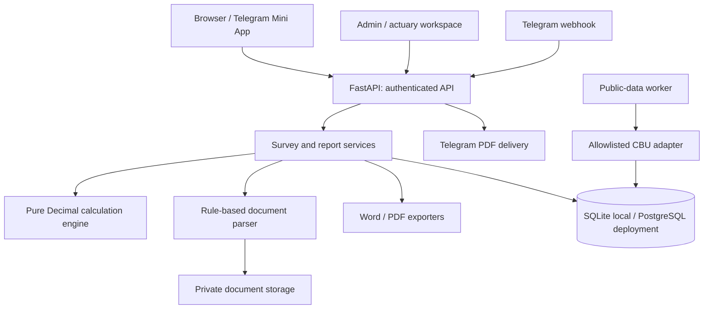

# Architecture

## Decision

Use a modular monolith: FastAPI serves the browser/Mini App, JSON API and Telegram webhook. SQLAlchemy persists application state; Alembic migrates SQLite locally and PostgreSQL in deployment. Static browser assets have no build-time application framework dependency. Playwright is a development-only browser-test dependency.

This keeps the small initial system easy to run, test and deploy. The calculation engine is independent of HTTP, storage and document parsing. Provider adapters can be replaced without moving financial calculations into an AI model or introducing distributed transactions.

## Boundaries

- `calculations.py`: formulas, minimum rates, annual equivalents, risk adjustments, valuation and loss ratios. No network calls.
- `documents.py`: size/format/page checks, office-archive limits, text extraction and source-linked field parsing. Images/scanned PDFs initially require review; the optional personal recognizer can propose values.
- `services.py`: tariff and template selection, scope/ownership, source context, report snapshots and cross-document conflicts.
- `reports.py`: five-section Word/PDF renderers driven only by the saved snapshot. No recalculation at export time.
- `auth.py`: Argon2 passwords, hashed opaque sessions, CSRF tokens, role checks and Telegram HMAC validation with a five-minute freshness limit.
- `sources.py`: explicit CBU adapter, channel registry, provenance, versioning, stale dates, circuit breaking. No arbitrary URL fetcher.
- `api.py`: input validation and application use cases. Pydantic input validation errors omit submitted values to avoid returning passwords.
- `db.py`: tables; report snapshots, documents and audit history persist across restarts. Optimistic inspection revisions reject stale edits.
- `telegram.py` and `cli.py`: webhook validation, update deduplication, private bot commands and explicit report delivery; optional polling and scheduled source worker.
- `telegram_setup.py`: explicit, identity-checked bot provisioning, HTTPS health preflight, webhook-move guard and settings read-back. It is not called automatically by ordinary app startup.
- `scripts/run_telegram_dev.py`: process orchestration for temporary Telegram HTTPS testing; separate from application logic. The regular local URL/configuration remains intact.

## Financial rules

Rates are percentages (`0.5` means 0.5%). Money uses `Decimal`; only the final premium is rounded to two decimal places. API JSON serializes decimals as strings. Annualization preserves precision independently of the displayed rate.

Risk and public-data adjustments are bounded by the class template, never lower a result below the product minimum and are labelled unapproved until actuarial approval. Statutory tariffs receive no discretionary adjustment. Missing programs/normative formulas return an undefined rate. Missing market data stays missing.

Calibration uses three completed years of company claims and total payouts / total premiums, not an unweighted mean of yearly ratios. An actuary supplies a target ratio and rationale; the derived adjustment is clamped to ±20% and the class limit. Source-data changes make that approval inapplicable. This is a transparent implemented calibration policy, not a claim that the insurer has approved it.

## History and provenance

Tariffs have immutable versions keyed by product code and effective date. Class template edits create versions. Source changes create indicator versions. Reports freeze product/template IDs, financial inputs, extracted values and excerpts, file SHA256 hashes, original/edited comparable prices, source links and dates, calibration evidence and warnings. Underwriter decisions append separately, and stale inspection revisions cannot be approved.

## Operational limits

The local profile uses one process and SQLite. Production should use PostgreSQL, HTTPS, backed-up persistent document storage and a managed scheduler. Login throttling is database-backed. The current Telegram delivery runs during the HTTP request: transient failures are visible and require a user retry; exactly-once delivery across a network failure is not claimed. Audit rows are append-only through the application API, not tamper-proof against database administrators.

Maximum file size: 15 MB; maximum PDF pages: 50; maximum photos: 25 MP; maximum documents per inspection: 20; office archives are limited by expanded size. PDF parsing is in-process and should be isolated in resource-limited workers if exposed to untrusted public uploads. Employee authentication is mandatory; this is not a public upload service.

## AI review boundary

`inspection_ai.py` stores validated proposals in private `ImportBatch` records (`kind=ai_document`), separate from `Document.extracted`. Inference uses the existing provider adapter and requires the configured Telegram owner, current inspection/configuration revisions and processing consent. No database transaction stays open during inference. A compare-and-swap on the inspection revision rejects changes during processing.

Review validates values through the same helper as manual document review, atomically consumes the proposal and increments the inspection revision. It invalidates final inspection confirmation and appends source quotations, original suggestions, decisions, reviewer/time and configuration provenance to document evidence. Consumed, stale, foreign and mismatched-file proposals cannot be applied. Ordinary import endpoints reject AI batches. No schema migration is needed.

Only reviewed document fields enter the inspection form; copying over existing inputs is explicit. Report snapshots and all export formats retain the reviewed evidence. Unreviewed proposals and freeform AI summaries do not enter reports or financial calculations. Model names record the configured value, or `provider_default` when the CLI selects it; this does not claim an independently verified resolved model ID.

## Reference contracts

- [Telegram Mini App validation](https://core.telegram.org/bots/webapps#validating-data-received-via-the-mini-app)
- [CBU official currency JSON feed documentation](https://www.cbu.uz/ru/arkhiv-kursov-valyut/veb-masteram/)
- [FastAPI file upload handling](https://fastapi.tiangolo.com/tutorial/request-files/)

## Completed source and review boundaries

- `document_api.py` handles employee review of each document. It preserves original extraction values and advances the parent inspection revision, invalidating review confirmation.
- `source_adapters.py` validates collector configuration, exact official hosts, robots policy, download limits and normalized schema. `source_lock.py` serializes host requests across local processes sharing the data volume.
- `napp.py` discovers official published workbooks and parses only the bounded insurance-class sheet. It retains published reporting periods and units; it does not infer annual market rates from aggregate balance-sheet statistics.
- `source_api.py` exposes permission/configuration controls, atomic source imports and operational status. No inspection inputs are interpolated into external requests.
- `references.py` versions public laws, notices and other text sources separately from numeric indicators. Selected versions are copied into report snapshots; a changed source creates an administrator audit alert.
- `regions.py` provides stable territory identifiers and aliases, preventing region spelling from silently dropping applicable statistics.
- `report_text.py` and `reports.sections` produce the same five readable sections for screen, Word and PDF. Source quotations remain original.
- `static/i18n.js` translates a fixed translation catalog of interface copy. Inputs, evidence JSON and report source text are excluded. There is no translation API or AI dependency.
- `maintenance.py` uses SQLite's consistent backup API, copies referenced immutable document files, verifies hashes/database integrity and restores only into a new directory. Restores invalidate old login sessions. The local worker schedules verified daily backups and prunes only valid backups beyond retention.

Class templates now include object-scoped statistical adjustment rules and valuation policy. The calculation is `(observation / baseline - 1) × sensitivity`, bounded by the rule and template limits. Regional series take priority over the same national metric. No automatic statistical association is presented as an insurer-approved model.

## Durable inspection assistance

`assistant_api.py` provides guided answers, queued owner-only analysis and reviewed findings. `inspection_assistant.py` builds the grounded context and validates citations through the shared provider boundary. `ai_jobs.py` claims durable database jobs with expiring leases and publishes results atomically; `scripts/run_ai_worker.py` runs independently of the browser. `Survey.assistance` stores human answers and reviewed evidence separately from financial inputs. Both evidence and deterministic context fingerprints invalidate obsolete explanations. Migration `483bbb0a63a7` introduces these private records. See [assistant workflow](inspection-assistant.md) and [deployment](../deploy/README.md).
