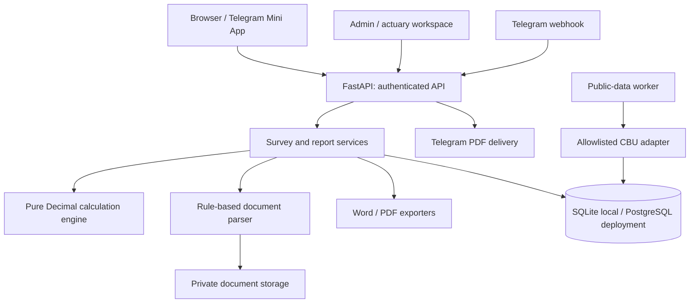

# Architecture

## Decision

Use a modular monolith: FastAPI serves the browser/Mini App, JSON API and Telegram webhook. SQLAlchemy persists application state; Alembic migrates SQLite locally and PostgreSQL in deployment. Static browser assets have no build-time application framework dependency. Playwright is a development-only browser-test dependency.

This keeps the small initial system easy to run, test and deploy. The calculation engine is independent of HTTP, storage and document parsing. Provider adapters can be replaced without moving financial calculations into an AI model or introducing distributed transactions.

## Boundaries

- `calculations.py`: formulas, minimum rates, annual equivalents, risk adjustments, valuation and loss ratios. No network calls.
- `documents.py`: size/format/page checks, office-archive limits, text extraction and source-linked field parsing. AI is absent; images/scanned PDFs are labelled manual.
- `services.py`: tariff and template selection, scope/ownership, source context, report snapshots and cross-document conflicts.
- `reports.py`: five-section Word/PDF renderers driven only by the saved snapshot. No recalculation at export time.
- `auth.py`: Argon2 passwords, hashed opaque sessions, CSRF tokens, role checks and Telegram HMAC validation with a five-minute freshness limit.
- `sources.py`: explicit CBU adapter, channel registry, provenance, versioning, stale dates, circuit breaking. No arbitrary URL fetcher.
- `api.py`: input validation and application use cases. Pydantic input validation errors omit submitted values to avoid returning passwords.
- `db.py`: tables; report snapshots, documents and audit history persist across restarts. Optimistic inspection revisions reject stale edits.
- `telegram.py` and `cli.py`: webhook validation, update deduplication, private bot commands and explicit report delivery; optional polling and scheduled source worker.
- `telegram_setup.py`: explicit, identity-checked bot provisioning, HTTPS health preflight, webhook-move guard and settings read-back. It is not called automatically by ordinary app startup.
- `scripts/run_telegram_dev.py`: process orchestration for temporary Telegram HTTPS testing; separate from application logic. The regular local URL/configuration remains intact.

## Financial rules

Rates are percentages (`0.5` means 0.5%). Money uses `Decimal`; only the final premium is rounded to two decimal places. API JSON serializes decimals as strings. Annualization preserves precision independently of the displayed rate.

Risk and public-data adjustments are bounded by the class template, never lower a result below the product minimum and are labelled unapproved until actuarial approval. Statutory tariffs receive no discretionary adjustment. Missing programs/normative formulas return an undefined rate. Missing market data stays missing.

Calibration uses three completed years of company claims and total payouts / total premiums, not an unweighted mean of yearly ratios. An actuary supplies a target ratio and rationale; the derived adjustment is clamped to ±20% and the class limit. Source-data changes make that approval inapplicable. This is a transparent implemented calibration policy, not a claim that the insurer has approved it.

## History and provenance

Tariffs have immutable versions keyed by product code and effective date. Class template edits create versions. Source changes create indicator versions. Reports freeze product/template IDs, financial inputs, extracted values and excerpts, file SHA256 hashes, original/edited comparable prices, source links and dates, calibration evidence and warnings. Underwriter decisions append separately, and stale inspection revisions cannot be approved.

## Operational limits

The local profile uses one process and SQLite. Production should use PostgreSQL, HTTPS, backed-up persistent document storage and a managed scheduler. Login throttling is database-backed. The current Telegram delivery runs during the HTTP request: transient failures are visible and require a user retry; exactly-once delivery across a network failure is not claimed. Audit rows are append-only through the application API, not tamper-proof against database administrators.

Maximum file size: 15 MB; maximum PDF pages: 50; maximum photos: 25 MP; maximum documents per inspection: 20; office archives are limited by expanded size. PDF parsing is in-process and should be isolated in resource-limited workers if exposed to untrusted public uploads. Employee authentication is mandatory; this is not a public upload service.

## Future AI boundary

A future recognizer can implement the same extraction result shape (`kind`, `mode`, `fields`, per-field source/excerpt/status). It must not set rates, invent missing fields or rewrite report numbers. Human review and provenance remain mandatory. No provider dependency or placeholder credential is needed now.

## Reference contracts

- [Telegram Mini App validation](https://core.telegram.org/bots/webapps#validating-data-received-via-the-mini-app)
- [CBU official currency JSON feed documentation](https://www.cbu.uz/ru/arkhiv-kursov-valyut/veb-masteram/)
- [FastAPI file upload handling](https://fastapi.tiangolo.com/tutorial/request-files/)
